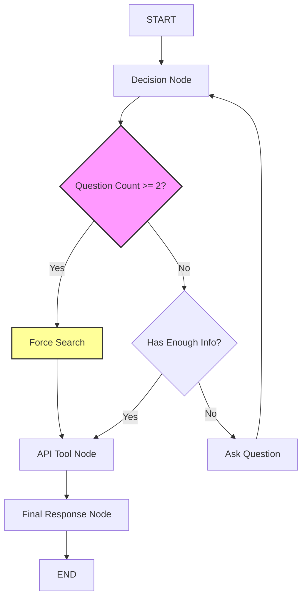

# Smart Property Agent

A conversational AI-powered property search assistant built with LangGraph, LangChain, and Groq LLM. This agent intelligently gathers user requirements through natural conversation and searches for properties using a real estate API.

## Features

- **Conversational Interface**: Interactive chat that asks clarifying questions to refine search criteria
- **Intelligent Decision Making**: Uses LLM to determine when to ask questions vs. perform searches
- **Property Search Tool**: Integrates with a property listing API to fetch real-time data
- **State Management**: Maintains conversation context and user preferences across interactions
- **Fallback Extraction**: Regex-based parsing for common queries (price, bedrooms, etc.)

## Prerequisites

- Python 3.8+
- API keys for:
  - Groq LLM (get from [groq.com](https://groq.com))
  - Property API 

## Installation

1. Clone the repository:
   ```bash
   git clone https://github.com/venkateshblks/langgraph-property-agent.git
   cd langgraph-property-agent
   ```

2. Install dependencies:
   ```bash
   pip install -r requirements.txt
   ```

3. Set up environment variables:
   - Copy `.env.example` to `.env`
   - Fill in your API keys:
     ```
     GROQ_API_KEY=your_groq_api_key_here
     PROPERTY_API_BASE=https://your-api-endpoint.com
     PROPERTY_API_KEY=your_property_api_key_here
     ```

## Usage

Run the interactive chat:
```bash
python main.py
```

The agent will guide you through specifying your property search criteria.

## Example Interaction

```
🏠 Smart Property Agent (Stable Version)

👤 You: properties in Seattle

==============================

📥 STEP: New user input

📍 Address: Seattle

🧠 LLM Decision: {'action': 'ask', 'question': 'What is the minimum price you are looking for?', 'slots': {'address': 'Seattle', 'min_price': None, 'max_price': None, 'min_bedroom': None, 'min_bathroom': None}}

📦 Slots: {'address': 'Seattle'}

🤖 Agent: What is the minimum price you are looking for?

👤 You: 500k

==============================

📥 STEP: New user input

💰 Price: 500000

🧠 LLM Decision: {'action': 'search', 'question': '', 'slots': {'min_price': 500000}}

📦 Slots: {'address': 'Seattle', 'min_price': 500000}

🤖 Agent: **Found 5 Properties in Seattle**

Here are the properties we found in Seattle, WA:

### Property 1

* **Address:** 123 Main St, Seattle, WA 98101

* **Subdivision:** Downtown

* **Bedrooms:** 3

* **Bathrooms:** 2

* **Price:** $750,000

* **Status:** Available

### Property 2

* **Address:** 456 Oak Ave, Seattle, WA 98102

* **Subdivision:** Capitol Hill

* **Bedrooms:** 2

* **Bathrooms:** 1

* **Price:** $650,000

* **Status:** Available

[...additional properties...]
```

## Architecture



- **LangGraph**: Orchestrates the conversational workflow with nodes for decision-making, API calls, and response formatting
- **LangChain**: Provides LLM integration and tool definitions
- **Groq LLM**: Powers the intelligent decision-making and response generation
- **Property API**: External service for real estate data

## License

MIT License - see LICENSE file for details
